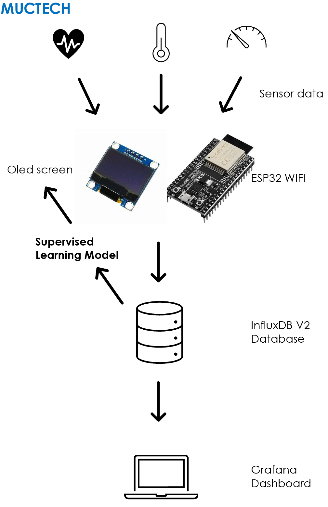

# PrAddict
A machine learning based device for addiction treatment, capable of detecting relapses in real time.

## The Idea
Addictions pose an enormous global socioeconomic threat. In Germany they amount to around one third of the stationary psychiatric patients and are one of the most common diagnoses among male patients. Unfortunately, however, around 90% of Europeans with addictive disorders receive little to no support. PrAddict tries to change that. Our device monitors vital data from patients, analyzes them in real-time and is capable to decide and even predict when a relapse is happening. In case a relapse is detected, the device displays supporting messages and will, in the future, be able to alert emergency contacts. 

## The Functionality
At the heart of our device lies an ESP32, which is monitoring all the available sensors, in this case: Heart rate, body temperature and movement. This data is directly passed on to our InfluxDB database, where we keep track of historical data and visualize it in a dashboard, giving the patient, family and medical staff an overview of the relapse patterns. At the same time, several Python scripts are accessing the database, retrieving the data and putting it through a supervised learning algorithm (decision tree) which is trained on the patients previous data. Once the prediction is made, it is sent back to the database and the ESP, which in case of a relapse displays the aforementioned messages.
